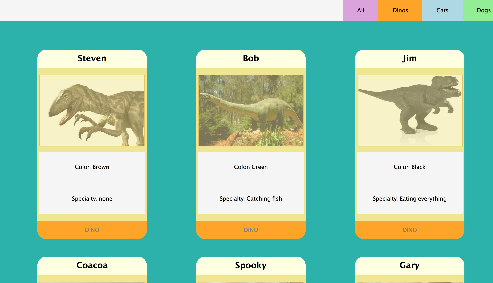

# PET-ADOPTION

## Description
This project shows off basic javascript functions, css styling, and html. its designed to demonstrate my ability to populate cards by looping through an array of objects and printing them to the dom.

## Feature List
- Adobtable pets are displayed when on the home or by clicking All

- All cats show when clicking the cats button

- All dogs show when clicking the dog button

- All dinos show when clicking the dino button

## Screenshot


## How to Run
- Make sure you have http-server installed via npm. if not get it [HERE](https://www.npmjs.com/package/http-server).

- On your command line run ``` hs -p 9898 ```
in your browser go to  ```http://localhost:9898```

## Contributors
[Zac Crumpton](https://github.com/ZacCrumpton)